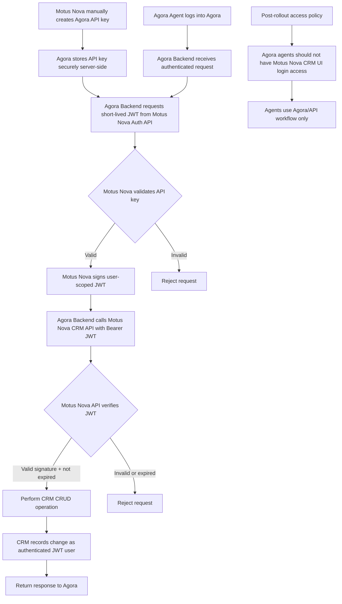

# Motus Nova API Auth Workflow

```mermaid
flowchart TD
    A[Agora Agent logs into Agora] --> B[Agora Backend receives authenticated request]

    K[Motus Nova manually creates Agora API key] --> L[Agora stores API key securely server-side]
    L --> C[Agora Backend requests short-lived JWT from Motus Nova Auth API]

    B --> C
    C --> D{Motus Nova validates API key}
    D -->|Valid| E[Motus Nova signs user-scoped JWT]
    D -->|Invalid| F[Reject request]

    E --> G[Agora Backend calls Motus Nova CRM API with Bearer JWT]

    G --> H{Motus Nova API verifies JWT}
    H -->|Valid signature + not expired| I[Perform CRM CRUD operation]
    H -->|Invalid or expired| J[Reject request]

    I --> M[CRM records change as authenticated JWT user]
    M --> N[Return response to Agora]

    O[Post-rollout access policy] --> P[Agora agents should not have Motus Nova CRM UI login access]
    P --> Q[Agents use Agora/API workflow only]
```
