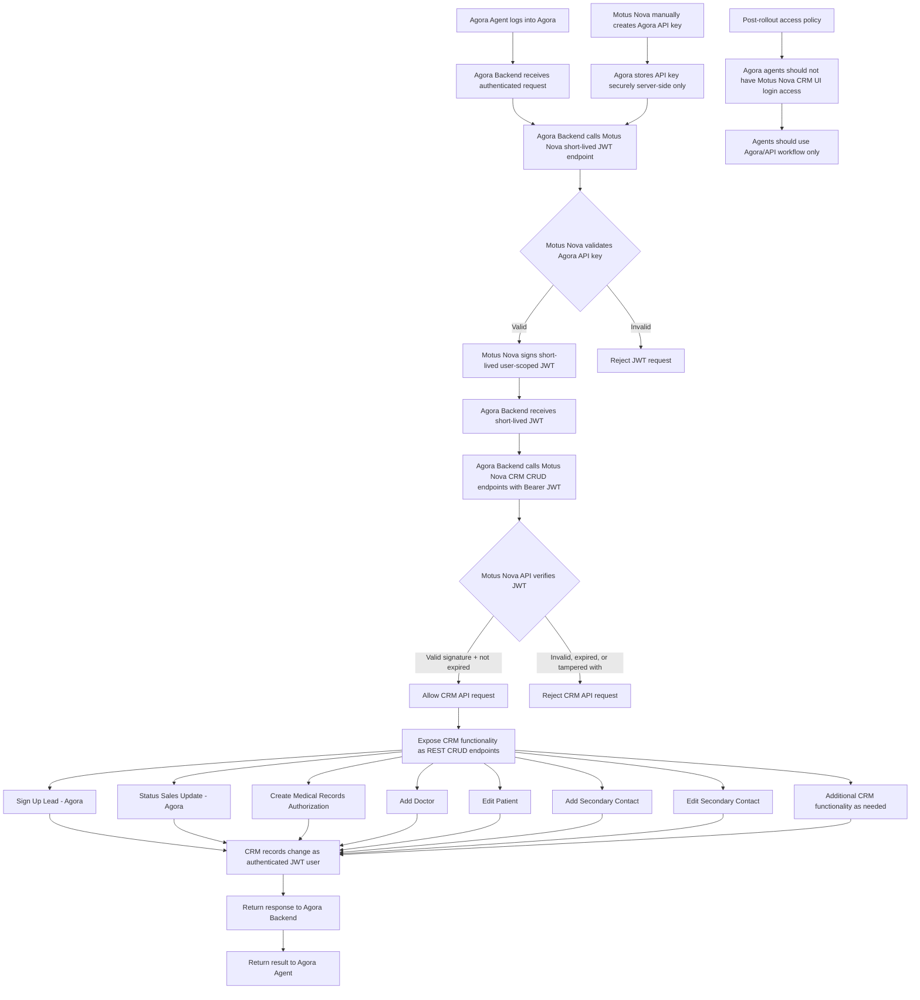

```mermaid
flowchart TD
    A[Agora Agent logs into Agora] --> B[Agora Backend receives authenticated request]

    K[Motus Nova manually creates Agora API key] --> L[Agora stores API key securely server-side only]

    B --> C[Agora Backend calls Motus Nova short-lived JWT endpoint]
    L --> C

    C --> D{Motus Nova validates Agora API key}
    D -->|Valid| E[Motus Nova signs short-lived user-scoped JWT]
    D -->|Invalid| F[Reject JWT request]

    E --> G[Agora Backend receives short-lived JWT]

    G --> H[Agora Backend calls Motus Nova CRM CRUD endpoints with Bearer JWT]

    H --> I{Motus Nova API verifies JWT}
    I -->|Valid signature + not expired| J[Allow CRM API request]
    I -->|Invalid, expired, or tampered with| X[Reject CRM API request]

    J --> CRUD[Expose CRM functionality as REST CRUD endpoints]

    CRUD --> C1[Sign Up Lead - Agora]
    CRUD --> C2[Status Sales Update - Agora]
    CRUD --> C3[Create Medical Records Authorization]
    CRUD --> C4[Add Doctor]
    CRUD --> C5[Edit Patient]
    CRUD --> C6[Add Secondary Contact]
    CRUD --> C7[Edit Secondary Contact]
    CRUD --> C8[Additional CRM functionality as needed]

    C1 --> M[CRM records change as authenticated JWT user]
    C2 --> M
    C3 --> M
    C4 --> M
    C5 --> M
    C6 --> M
    C7 --> M
    C8 --> M

    M --> N[Return response to Agora Backend]
    N --> O[Return result to Agora Agent]

    P[Post-rollout access policy] --> Q[Agora agents should not have Motus Nova CRM UI login access]
    Q --> R[Agents should use Agora/API workflow only]
```
